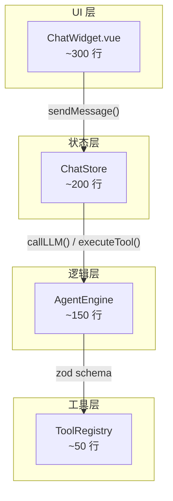
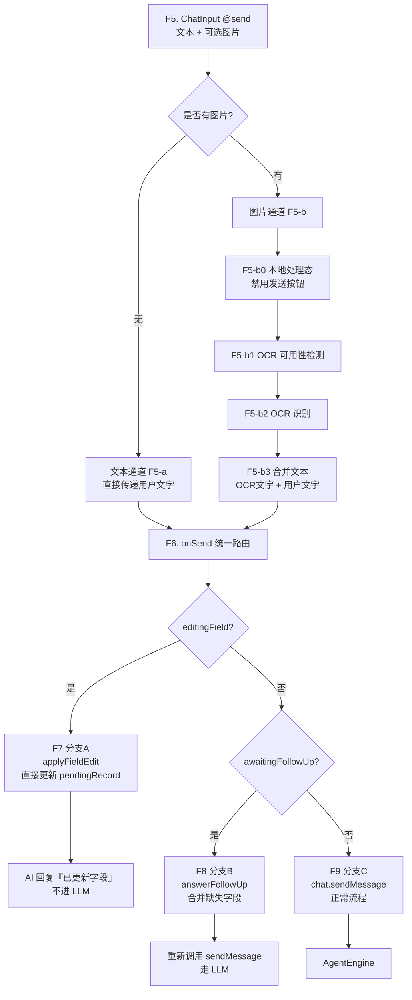
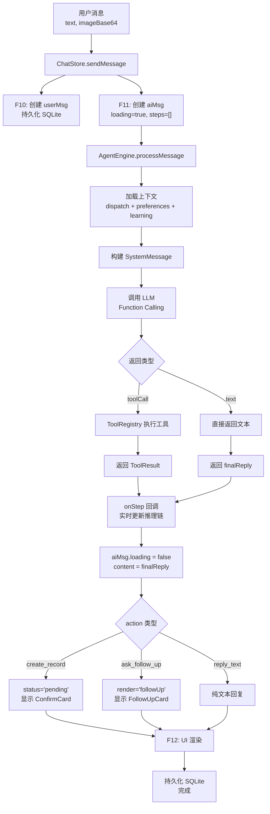
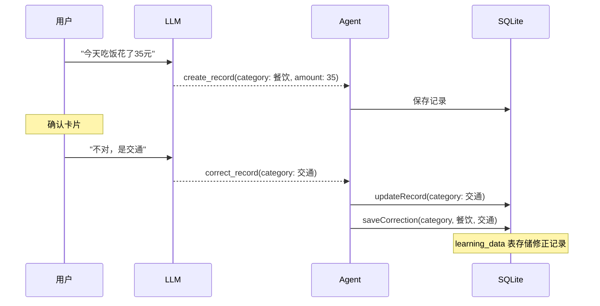

# 进行中的设计文档

> 本文件包含进行中的专项设计：AI Agent 架构重构、OCR Python 管理重设计、Agent Session 架构。

---

## 1. AI Agent 架构重构

> 最后更新：2026-06-05
> **状态：✅ 已完成**（2026-06-03 风险分级修正流已实现，2026-06-05 Session 架构已完成）

### 1.1 背景与目标

**原问题**：Agent 架构采用手写 dispatch prompt + JSON 解析模式——LLM 调用通过 50+ 行 JSON schema 定义在 system prompt 中，响应用正则提取 JSON，上下文管理拼接最近 6 条消息为字符串，`ChatWidget.vue` 1200 行同时充当 store/orchestrator/presenter。

**已实现目标**：
1. **用 Function Calling 替代手写 dispatch prompt** — 标准格式、不 parse JSON、token 减半
2. **推理链可视化** — 每条消息展示完整执行过程（意图识别 → 字段提取 → 执行入库 → 最终回复）
3. **分层架构** — UI 层（~300行）/ Store 层（~200行）/ Agent 层（~150行）/ 工具层（~50行）
4. **开发者调试** — Ctrl+` 打开控制台，查看每轮 LLM 调用的原始请求/响应
5. **对话即学习** — 用户自然对话纠正，LLM 自动检测纠正意图，Agent 自动提取差异存入 learning_data
6. **风险分级修正流** — `lastConfirmedRecord`、支付方式防编造、低风险直接执行、高风险 `CorrectionConfirmCard` 确认

### 1.2 分层架构

```
┌─────────────────────────────────────────────────┐
│  ChatWidget.vue (UI 层, ~300 行)                 │
│  - 消息列表渲染 / 输入框 / 欢迎页/设置面板        │
├─────────────────────────────────────────────────┤
│  ChatStore (状态层, ~200 行)                      │
│  - messages[] / conversationHistory[] / state    │
│  - sendMessage() / confirmRecord() / cancel()    │
├─────────────────────────────────────────────────┤
│  AgentEngine (逻辑层, ~150 行)                     │
│  - callLLM() / executeTool() / 构建历史 / 注入   │
├─────────────────────────────────────────────────┤
│  ToolRegistry (工具层, ~50 行)                     │
│  - zod schema + 类型安全执行器                   │
└─────────────────────────────────────────────────┘
```

**Mermaid 版本：**



### 1.3 数据流

#### 输入预处理（ChatWidget.vue → onSend）

**F5. ChatInput @send** 输出文本和图片两条并行通道：

```
──────────────────────────────────────────────┐
│ F5. ChatInput @send（文本 + 可选图片）          │
──────────────────────────────────────────────┤
│  文本通道（F5-a）     │  图片通道（F5-b）         │
│  用户文字直接传递      │  有图片时触发：          │
│                     │  ├─ F5-b0 本地处理态     │
│                     │  │  禁用发送按钮         │
│                     │  ├─ F5-b1 OCR 可用性检测 │
│                     │  ├─ F5-b2 OCR 识别       │
│                     │  ─ F5-b3 合并文本        │
│                     │    (OCR 文字 + 用户文字)  │
└───────┬──────────────┴───────────────────────┘
        │                      │
        ▼                      ▼
┌──────────────────────────────────────────────┐
│ F6. onSend() 统一路由（含完整文本）             │
├──────────────────────────────────────────────┤
│  分支A: editingField（F7）                    │
│    applyFieldEdit 直接更新 pendingRecord       │
│    AI 回复『已更新字段』，不进 LLM              │
│                                               │
│  分支B: awaitingFollowUp（F8）                │
│    answerFollowUp 合并缺失字段                  │
│    重新调用 sendMessage（走 LLM）              │
│                                               │
│  分支C: 正常流程（F9）                         │
│    chat.sendMessage() → AgentEngine           │
──────────────────────────────────────────────┘
```

**Mermaid 流程图版本：**



**onSend() 路由逻辑**（ChatWidget.vue）：

```typescript
async function onSend(text: string, imageBase64?: string) {
  // 分支A: 编辑字段模式
  if (chat.editingField) {
    chat.applyFieldEdit(text);
    messages.value.push({ role: 'ai', content: '已更新字段' });
    return;
  }

  // 分支B: 追问补全模式
  if (chat.awaitingFollowUp) {
    await chat.answerFollowUp(text, messagesRef.value);
    return;
  }

  // 分支C: 正常流程
  await chat.sendMessage(text, messagesRef.value, imageBase64);
}
```

#### 核心流程（ChatStore → AgentEngine → ToolRegistry）

```
用户消息 → ChatStore.sendMessage(text, imageBase64)
  → F10: 创建 userMsg 推入 messages[] → 持久化 SQLite
  → F11: 创建 aiMsg (loading=true, steps=[])
  → B4: AgentEngine.processMessage(text, onStep 回调)
    ├─ 加载上下文（dispatch prompt + preferences + learning data）
    ├─ 构建 SystemMessage（拼接 prompt + 偏好 + 学习纠正上下文）
    ├─ 调用 LLM（Function Calling）→ toolCall 或 text
    ├─ 执行工具 → ToolResult（纯数据）
    └─ 返回 { steps[], toolResult, finalReply, action }
  → onStep 回调实时更新 aiMsg.steps → UI 逐步显示推理链
  → aiMsg.loading = false, content = finalReply
  → 根据 action 类型设置 aiMsg.status/render/data:
    ├─ create_record/create_trip_record → status='pending', 显示 ConfirmCard
    ├─ ask_follow_up → render='followUp', awaitingFollowUp=true, 显示 FollowUpCard
    └─ reply_text → 纯文本回复
  → F12: UI 渲染（loading→spinner / steps→推理链 / content→文本 / pending→ConfirmCard）
  → 持久化到 SQLite
```

**Mermaid 流程图版本：**



> **注**：OCR 在 ChatWidget.onSend 中预处理（F5-b 图片通道），AgentEngine 收到的 text 已是合并后的完整文本。

### 1.4 消息历史

**UI 消息**（`messages[]`）vs **LLM 消息历史**（`conversationHistory[]`）分离：

```typescript
// UI 消息：包含 rich UI 数据
interface ChatMessage {
  id: number;
  role: 'user' | 'ai';
  content: string;
  data?: Record<string, unknown>;
  render?: string;        // text | card | chart | list
  steps?: Step[];         // 推理链步骤
  status?: 'pending' | 'confirmed' | 'cancelled' | 'success';
}

// LLM 消息历史：标准格式
interface LLMMessage {
  role: 'user' | 'assistant' | 'tool';
  content: string | null;
  tool_call_id?: string;  // tool 返回结果时的标识
}
```

### 1.5 决策记录

| 决策 | 说明 |
|---|---|
| 降级方案 | LLM 不可用时使用正则提取字段，UI 标注"⚠️ 使用本地解析" |
| Tool 返回值拆分 | ToolResult（纯数据给 LLM）vs ActionResult（UI 渲染） |
| OCR 失败 | 一律中止流程，识别到的文本在步骤详情里显示 |
| 上下文窗口 | 固定 10 轮对话窗口 |
| 思考过程展示 | 始终可见，确认记录后仍保留；折叠后透明度 0.7 作为历史痕迹保留 |
| 消息持久化 | 保持现有 `chat_history` 表，steps[] 存 data 字段 JSON |
| Prompt 管理 | Settings 页面独立卡片，分 dispatch / preferences 两个刷新按钮，运行时从 .md 文件读取覆盖数据库 |
| 类型安全 | zod 方案：一个定义同时生成 JSON Schema + TypeScript 类型 + 运行时校验 |
| 流式输出 | 先不加，后续再加 |
| 学习引擎 | LLM 检测纠正意图，Agent 自动对比原始字段和修正字段存入 learning_data |

### 1.6 组件详细设计

#### ToolRegistry（工具注册表）

```typescript
import { z } from 'zod';

const CreateRecordSchema = z.object({
  datetime: z.string().optional(),
  type: z.enum(['收入', '支出']).transform(s => s.trim()),
  category: z.string().optional(),
  // OCR 可能提取负数（如 -8.00），自动取绝对值
  amount: z.coerce.number().transform(a => Math.abs(a)).refine(a => a > 0, '金额必须大于 0'),
  account: z.string().optional(),
  note: z.string().optional(),
  payment: z.string().optional(),
});

type CreateRecordArgs = z.infer<typeof CreateRecordSchema>;

interface Tool<Args, Result> {
  name: string;
  description: string;
  schema: z.ZodType<Args>;
  execute: (args: Args) => Promise<Result>;
}

class ToolRegistry {
  private tools = new Map<string, Tool<any, any>>();

  register<Args, Result>(tool: Tool<Args, Result>) {
    this.tools.set(tool.name, tool);
  }

  getTools() {
    return [...this.tools.values()].map(t => ({
      type: 'function',
      function: { name: t.name, description: t.description, parameters: zodToJsonSchema(t.schema) },
    }));
  }

  async execute(name: string, args: unknown): Promise<ToolResult> {
    const tool = this.tools.get(name);
    if (!tool) return { success: false, error: `未知工具: ${name}` };
    const parsed = tool.schema.safeParse(args);
    if (!parsed.success) return { success: false, error: `参数校验失败: ${parsed.error}` };
    try {
      const result = await tool.execute(parsed.data);
      return { success: true, result };
    } catch (e) {
      return { success: false, error: e instanceof Error ? e.message : String(e) };
    }
  }
}
```

#### AgentEngine（逻辑层）

核心流程：加载上下文 → 构建 SystemMessage → 调用 LLM（Function Calling）→ 执行工具 → 反馈结果给 LLM → 生成最终回复 → 组装推理链。

> **注意**：OCR 已移至前端输入预处理阶段（F5-b 图片通道），AgentEngine 收到的 text 参数已是合并后的完整文本。OCR 步骤仍在推理链中显示（B14 StepList），但实际识别发生在前端。

推理链步骤结构：

```typescript
interface Step {
  id: string;
  title: string;          // '意图识别', '字段提取', '执行入库', '最终回复'
  status: 'running' | 'success' | 'error';
  detail?: StepDetail;
  collapsed: boolean;
}

interface StepDetail {
  action?: string;
  confidence?: number;
  fields?: Array<{ label: string; value: string; source: 'extracted' | 'inferred' | 'default' }>;
  result?: { message?: string; id?: number };
  ocr?: { status: string; latency: number; recognizedText: string; error?: string };
}
```

#### 开发者控制台

快捷键 `Ctrl+`` 打开/关闭，用于排查前端 IPC、LLM 请求和 Rust 后端日志。

| Tab | 数据来源 | 说明 |
|---|---|---|
| IPC 调用 | `src/utils/invoke-logger.ts` 封装的 Tauri `invoke()` | 自动记录 command、参数、返回值/错误和耗时 |
| LLM 请求 | `AgentEngine` 内部 `LLMLogEntry` | 成功/失败都记录 system message、用户消息、响应/错误和耗时；通过 listener 实时推送到 DevConsole |
| Rust 端 | Rust `logger.rs` 发出的 `app_log` 事件 | 关键后端诊断日志，例如 LLM API 请求成功/失败、AI 连接测试结果 |

```typescript
interface LLMLogEntry {
  id: number;
  /** 请求 ID，用于关联 IPC 日志 */
  requestId: string;
  timestamp: string;
  systemMessage: string;
  userMessage: string;
  response: string;  // 失败时以 [错误] 开头
  latency: number;
  steps: string[];
}
```

**日志关联机制**：
- IPC、LLM、Rust 日志通过 `requestId` 字段串联
- 开发环境日志文件：`{项目根目录}/logs/app_YYYY-MM-DD.jsonl`
- 生产环境日志文件：`~/Library/Application Support/com.accounting-app.app/logs/app_YYYY-MM-DD.jsonl`（macOS）
- 日志格式为 JSONL（每行一个 JSON 对象），包含 `level`、`module`、`message`、`timestamp`、`requestId` 等字段

**日志收集规则**：
- IPC 日志由前端 invoke 拦截器维护内存环形列表，DevConsole 打开时读取快照。
- LLM 日志由 `AgentEngine.addLLMListener()` 实时推送；调用失败时也写入日志，便于查看 API Key、URL、JSON 解析等错误。
- Rust 日志由前端组件挂载后持续监听 `app_log`，不再依赖 DevConsole 是否打开或当前是否激活 Rust tab，避免运行时事件丢失。
- Rust 日志不得输出 API Key 等敏感信息；错误响应只展示必要摘要。

功能：列表（时间/耗时/状态）、详情（完整请求/响应或错误）、复制当前 Tab、清空当前 Tab。

#### 已确认的 Agent 解析修正

> 2026-06-02 确认，用于修复 DevConsole 暴露出的识别问题。

1. **相对时间基准**：`AgentEngine.buildSystemMessage()` 每次动态注入当前日期时间。用户提到“今天、昨天、前天、明天、本周、本月、中午、晚上、早上”等相对时间时，LLM 必须基于当前时间换算。
2. **孤儿 `_source` 字段**：Prompt 明确要求“未返回字段时不要返回对应 `xxx_source`”；前端在解析 tool call 后清理没有对应字段的 `_source`，日志保留原始 LLM 响应用于调试。
3. **支付方式规则去重**：`dispatch.md` 和 SQLite `system_prompts.dispatch` 保持一致，支付方式规则只保留一组清晰约束，避免 token 浪费和规则噪声。
4. **确认卡状态文案**：确认卡明确显示“尚未保存”，并提示“点击确认后才会写入账本”，避免误解为 AI 生成卡片后已经入库。

#### Prompt 管理（Settings 页面）

```
Prompt 管理
─────────────────────────────────────────────────
修改 dispatch.md 文件后，点击"从文件刷新"将更新同步到数据库。
刷新后需重新加载 AI 对话上下文才能生效。

[ 刷新 dispatch.md ]  [ 刷新 preferences.md ]
```

**实现**：
- `refresh_prompt_from_file` Tauri 命令：运行时读取 `prompts/{name}.md` 文件，覆盖 SQLite `system_prompts` 表
- 刷新后自动调用 `agentEngine.resetContext()`，下次消息触发重新加载
- 不依赖 `include_str!` 编译时嵌入，支持开发时即时生效

#### 系统诊断（Settings 页面）

```
┌─────────────────────────────────────────┐
│  AI 服务                                │
│  状态:  🟢 已连接                        │
│  服务:  LM Studio (qwen3.6-35b)          │
│  URL:  http://121.17.49.99:1234         │
│  延迟:  230ms (最近 5 次平均)             │
│  [测试连接]                               │
│                                         │
│  最近请求日志                            │
│  14:32:15  create_record  ✅ 230ms      │
│  14:31:42  query_records   ✅ 180ms      │
│  [导出 JSON] [清空日志]                   │
└─────────────────────────────────────────┘
```

#### 对话即学习

用户纠正场景：用户说"今天吃饭花了35元"→ LLM 识别为餐饮 → 用户说"不对，是交通"→ LLM 识别为 correct_record → Agent 自动执行纠正 + 提取差异存入 learning_data。

```typescript
const original = await getRecord(recordId);
await updateRecord(recordId, args.fields);

for (const [key, newValue] of Object.entries(args.fields)) {
  if (original[key] && original[key] !== newValue) {
    await saveCorrection(key, String(original[key]), String(newValue));
  }
}
```

**Mermaid 流程图版本：**



### 1.7 文件变更清单

#### 新增文件

| 文件 | 说明 |
|---|---|
| `src/ai/tool-registry.ts` | ToolRegistry 类，zod schema + 执行器 |
| `src/ai/agent-engine.ts` | AgentEngine 类，LLM 调用 + 工具执行 + 推理链构建 |
| `src/components/chat/StepList.vue` | 推理链可视化组件 |
| `src/components/chat/DevConsole.vue` | 开发者控制台 |
| `src/stores/chat.ts` | 重构后的 ChatStore |
| `src/utils/invoke-logger.ts` | IPC 调用日志记录，含 requestId 生成和关联 |
| `src-tauri/src/logger.rs` | Rust 端结构化日志，写入 JSONL 文件 |
| `src/components/ErrorBoundary.vue` | 错误边界组件 |

#### 修改文件

| 文件 | 变更 |
|---|---|
| `src/components/chat/ChatWidget.vue` | 瘦身为纯 UI 层，~300 行 |
| `src/components/chat/ChatMessage.vue` | 渲染 StepList + 最终结果 |
| `src/views/Settings.vue` | 新增 Prompt/偏好/学习数据 tab + 系统诊断 |
| `src-tauri/src/commands/config.rs` | 支持 Function Calling 格式 |
| `src-tauri/src/db/prompts.rs` | 精简 dispatch prompt |
| `package.json` | 新增 zod 依赖 |

#### 删除文件

| 文件 | 理由 |
|---|---|
| `src/ai/dispatch.ts` | 被 agent-engine.ts 替代 |
| `src/ai/actions.ts` | 被 tool-registry.ts 替代 |
| `src/components/chat/DebugPanel.vue` | 被 DevConsole.vue 替代 |
| `src/components/chat/ChatThinking.vue` | 被 StepList.vue 替代 |
| `src/components/chat/RulesPanel.vue` | 功能移到 Settings 页面 |

### 1.8 实施顺序

> ✅ 全部完成（2026-05-27）

1. [x] 添加 zod 依赖 + 实现 ToolRegistry
2. [x] 创建 AgentEngine 层（LLM 调用 + 工具执行 + 推理链构建）
3. [x] 重构 ChatStore（状态管理 + 对话流程）
4. [x] 创建 StepList 组件（推理链可视化）
5. [x] 重构 ChatWidget（瘦身为纯 UI）
6. [x] 实现开发者控制台
7. [x] 更新 Settings 页面（Prompt/偏好/学习数据 tab + 系统诊断）
8. [x] 更新 Rust 后端（Function Calling 支持）
9. [x] 清理旧代码

### 1.9 测试计划

| 场景 | 预期 |
|---|---|
| 正常记账 | 推理链完整显示（意图识别 → 字段提取 → 执行入库 → 回复） |
| 图片 OCR | 点击发送后立即禁用发送按钮；OCR 步骤显示在推理链中，识别文本可见 |
| OCR 失败 | 中止流程，显示错误步骤 |
| LLM 不可用 | 降级到本地正则解析，标注"使用本地解析" |
| 纠正记录 | LLM 自动识别纠正意图，自动更新记录 + 存入学习数据 |
| 追问补充 | 追问步骤显示在推理链中，用户回复后重新 dispatch |
| 多工具调用 | 每个工具独立步骤展示 |
| 开发者控制台 | Ctrl+` 打开，显示完整请求/响应 |
| 多轮对话 | 保持最近 10 轮，旧对话自动截断 |
| 持久化 | steps[] 存 data 字段 JSON，加载历史消息正常渲染 |

---

## 1.5 Agent Session 架构

> 最后更新：2026-06-05
> **状态：✅ 已完成**

### 1.5.1 问题

原设计中 `chat_history` 表只存储 UI 渲染数据（`_render`、`_status`、`_steps`），LLM 对话上下文（`conversationHistory`）只存在内存中。导致：
- 刷新页面后 Agent "失忆"，无法理解"修改上一条"等连贯对话
- 历史消息的 `pending` 状态恢复错误（已确认的卡片显示"尚未保存"）
- 思考过程在历史消息中重复显示

### 1.5.2 解决方案：存储事实，UI 状态从事实推导

**数据持久化结构**（`chat_history.data`）：

```typescript
interface PersistedChatData {
  llmMessages?: LLMMessage[];   // 用于恢复 Agent 上下文
  _steps?: Step[];              // 推理步骤，历史消息展示思考过程
  record?: Record<string, unknown>;  // 记录字段
  result?: { success: boolean; action?: string; message?: string };
}
```

**三层记忆架构**：

```
活跃上下文 → conversationHistory（内存，刷新时从数据库恢复）
对话归档   → chat_history 表（带 session_id，持久化）
持久记忆   → learning_data + preferences
```

### 1.5.3 关键设计决策

| 决策 | 说明 |
|---|---|
| session_id | 应用每次启动生成新 session，格式 `session_{timestamp}_{random}` |
| 上下文恢复 | `loadHistory()` 提取 `llmMessages` → `agentEngine.restoreContext()` |
| UI 状态推导 | 从 `data.result` 推导 `status`，不存储瞬时状态 |
| 取消状态持久化 | `cancelRecord` 保存取消状态到数据库，刷新后保持取消状态，不重复显示确认卡片 |
| 确认卡片折叠 | 卡片头部可点击折叠/展开，复用思考过程的折叠样式，保持视觉一致性 |
| 卡片标题逻辑 | 根据 `status` 显示：`cancelled`→"已取消"，`confirmed/success`→"已保存"，其他→"记录详情" |
| 历史消息只读 | 历史卡片显示"已保存"，无操作按钮 |
| 支付默认值 | 用户未提及默认"现金"，标注 source=default，需用户确认 |
| 支付始终显示 | 所有卡片（ConfirmCard/RecordCard/CorrectionConfirmCard）强制显示 |

### 1.5.3.1 智能上下文注入

**核心原则**：正常记账不带历史，检测到修正意图时注入上下文。

**触发条件检测**（`needsHistoryContext`）：

| 触发类型 | 关键词 | 例子 |
|---|---|---|
| 显式引用 | `上面`、`前面`、`上一条`、`刚才`、`上条`、`之前` | "上面说的不对" |
| 修正动作 | `改成`、`改为`、`改一下`、`修正`、`纠正`、`更新`、`修改` | "改成家庭支出" |
| 否定判断 | `不对`、`错了`、`不是`、`有误`、`错误` | "金额不对" |
| 省略主语 | `应该是`、`应为`、`应是` | "应该是餐饮" |

**注入策略**：

| 场景 | 注入内容 |
|---|---|
| 无修正意图 | 不注入任何历史（正常记账省 token） |
| 检测到修正意图 + 有 lastConfirmedRecord | 注入结构化摘要（金额/分类/账户/支付/备注/时间） |
| 检测到修正意图 + 无 lastConfirmedRecord | 降级注入最近 3 轮对话摘要 |

**上下文摘要格式**：
```
## 上一条记录
金额：285.86 元
类型：支出
分类：购物
账户：个人
支付：招商银行信用卡 (7502)
备注：深州信誉楼百货
时间：2026-06-01 18:36
```

**数据流**：
```
确认记录 → agentEngine.setLastConfirmedRecordContext(record)
                                   ↓
                          lastConfirmedRecordContext = 结构化摘要
                                   ↓
用户输入"改成 50 元" → needsHistoryContext() = true
                                   ↓
                          注入: "## 上一条记录\n金额：285.86元..."
                                   ↓
                          LLM 知道修改目标，直接返回修正工具调用
```

### 1.5.4 数据流

```
用户输入 → AgentEngine 处理 → conversationHistory 追加
                                    ↓
                              persistMessage 存入:
                              { llmMessages, record, result, _steps }
                                    ↓
                              刷新页面 → loadHistory()
                                    ↓
                              提取 llmMessages → 恢复 Agent 上下文
                              提取 record/result → 推导 UI 状态
```

### 1.5.5 数据库变更

```sql
-- chat_history 新结构
CREATE TABLE chat_history (
    id INTEGER PRIMARY KEY AUTOINCREMENT,
    uuid TEXT UNIQUE NOT NULL,
    session_id TEXT NOT NULL,               -- 新增
    role TEXT NOT NULL,
    content TEXT,
    data TEXT,                              -- 存储 PersistedChatData JSON
    created_at TEXT DEFAULT (datetime('now', 'localtime'))
);
CREATE INDEX idx_chat_history_session ON chat_history(session_id, created_at);
-- 删除字段：skill, confidence
```

---

## 2. OCR Python 管理重设计

> 最后更新：2026-06-04
> **状态：✅ 已完成**
>
> 完成项：
> - [x] 系统 Python 列表展示（版本/路径/PaddleOCR 状态/来源标签）
> - [x] 活跃 Python 选择与持久化
> - [x] 依赖管理（安装/卸载/重装 PaddleOCR）
> - [x] 内置 Python 生命周期管理
> - [x] 事件驱动发现机制（startOcrDiscover → ocr_discover_result）
> - [x] 扫描加载状态显示
> - [x] Microsoft Store Python 限制处理（标记为不可用）
> - [x] PaddleOCR/PaddlePaddle 版本检测与显示
> - [x] 终端面板日志路由修复（operationSessionId）
> - [x] OCR 服务简化为纯 CPU 模式（移除 GPU 依赖）

### 2.1 背景

当前 OCR 设置只能检测到一个 Python（优先内置，回退到系统），pip 安装依赖时可能用到不兼容的 Python 3.14。用户需求：
1. 列出系统中所有 Python 版本及路径和兼容性
2. 对每个兼容 Python 进行依赖管理（安装/重装/卸载 PaddleOCR）
3. 内置 Python 的完整生命周期管理，路径显示清晰

### 2.2 数据设计

#### 新增类型：`SystemPython`

```rust
pub struct SystemPython {
    pub path: String,
    pub version: String,           // "Python 3.12.9"
    pub minor_version: u8,         // 12 (for compatibility check)
    pub is_compatible: bool,       // PaddleOCR supports Python 3.8-3.12
    pub has_paddleocr: bool,
    pub source: String,            // "macos" | "uv" | "homebrew" | "pythonorg" | "pyenv" | "store" | "unknown"
    pub is_usable: bool,           // false for Microsoft Store Python (cannot install deps in non-interactive terminal)
}
```

#### 新增类型：`ActivePython`

```rust
pub struct ActivePython {
    pub path: String,
    pub version: String,
    pub is_bundled: bool,
    pub has_paddleocr: bool,
    pub paddleocr_version: Option<String>,       // PaddleOCR 版本号，如 "2.7.0"
    pub paddlepaddle_version: Option<String>,    // PaddlePaddle 版本号，如 "2.6.2"
}
```

### 2.3 OCR 服务模式

**当前配置**：
- PaddleOCR: 2.7.0
- PaddlePaddle: 2.6.2 (CPU)
- 运行模式: 纯 CPU，无 GPU 依赖

**简化原因**：
- PaddlePaddle 3.x 无 GPU 版本可用（PyPI 仅提供 2.6.x GPU 版）
- PaddleOCR 3.x API 变更，与 PaddlePaddle 2.x 不兼容
- GPU 模式需要额外安装 CUDNN，配置复杂
- 对于票据识别场景，CPU 性能已完全足够

#### 修改 `OcrStatus`

```rust
pub struct OcrStatus {
    pub available: bool,                       // 当前活跃 Python 可用
    pub enabled: bool,                          // OCR 总开关
    pub active_python: Option<ActivePython>,    // 当前使用的 Python
    pub system_pythons: Vec<SystemPython>,      // 系统中所有 Python
    pub bundled_python_installed: bool,
    pub message: String,
}
```

### 2.3 Rust 端改动

#### 文件：`src-tauri/src/commands/ocr.rs`

##### 发现所有系统 Python — `discover_system_pythons()`

**macOS 扫描路径（按优先级）：**

| 来源 | 扫描路径 | 说明 |
|---|---|---|
| Homebrew (Apple Silicon) | `/opt/homebrew/Cellar/python@*/Versions/Current/bin/python3` | 遍历所有 `python@3.*` |
| Homebrew (Intel) | `/usr/local/Cellar/python@*/Versions/Current/bin/python3` | 遍历所有 `python@3.*` |
| Python.org 框架 | `/Library/Frameworks/Python.framework/Versions/*/bin/python3` | 遍历所有版本目录 |
| pyenv | `~/.pyenv/versions/*/bin/python` | 遍历所有 pyenv 版本 |
| 系统 | `/usr/bin/python3`, `/usr/bin/python` | macOS 系统自带（可能只有 3.9）|

**Windows 扫描路径（按优先级）：**

| 来源 | 扫描方式 | 说明 |
|---|---|---|
| PATH | `python`, `python3`, `py`（py launcher） | 通过 `Get-Command` 和 `py -0p` 发现 |
| Microsoft Store | `winget list --name Python` + 注册表 `HKCU:\SOFTWARE\Microsoft\Windows\CurrentVersion\Explorer\Shell Folders\Local AppData` | WindowsApps 目录下的 App Execution Aliases |
| 注册表 HKLM | `HKLM:\SOFTWARE\Python\PythonCore\*\InstallPath` | 所有用户安装的 Python |
| 注册表 HKCU | `HKCU:\SOFTWARE\Python\PythonCore\*\InstallPath` | 当前用户安装的 Python |
| 常见路径 | `%LOCALAPPDATA%\Programs\Python\Python3*\` | Python.org 安装器默认路径 |
| 常见路径 | `%PROGRAMFILES%\Python3*\` | 全局安装路径 |

**Microsoft Store Python 限制：**
- Microsoft Store 安装的 Python 使用 App Execution Aliases（`.exe` stub 文件）
- 这些 stub 文件在非交互式终端环境（如 Tauri 后台进程）中无法执行
- 即使使用 `wt send-keys`、`.cmd` 批处理、`Start-Process` 等方式也无法绕过此限制
- 这是 Windows 安全机制，不是技术缺陷
- **处理方式**：在 Python 列表中标记为"Microsoft Store"标签，"操作"列显示"不可用"按钮，tooltip 提示用户从 python.org 下载安装

对每个找到的 `python3` 可执行文件：
1. 运行 `--version` 获取版本字符串
2. 解析 minor version（如 "Python 3.12.9" → 12）
3. 检查兼容性：`8 <= minor <= 12`
4. 检查 PaddleOCR：`python -c "import paddleocr"`
5. 如果已安装 PaddleOCR，获取版本号：`python -c "import paddleocr; print(paddleocr.__version__)"`
6. 如果已安装 PaddlePaddle，获取版本号：`python -c "import paddle; print(paddle.__version__)"`

### 2.3 Rust 端改动

#### 文件：`src-tauri/src/commands/ocr.rs`

##### 发现所有 Python — `discover_all_pythons()`

合并内置 Python + 系统 Python：先检查内置 Python（如果存在，加入列表），再调用 `discover_system_pythons()` 获取系统 Python，去重（同一路径只保留一个）。

**事件驱动发现机制：**

- 前端调用 `startOcrDiscover()` 命令，Rust 后台立即返回（不阻塞 UI）
- Rust 在后台线程执行 `discover_all_pythons()`（PowerShell 脚本扫描）
- 扫描完成后通过 Tauri 事件 `ocr_discover_result` 将结果推送给前端
- 前端在 `onMounted` 中先注册事件监听器，再调用 `startOcrDiscover()`
- 监听器收到事件后更新 `systemPythons` 并关闭 `discoverLoading` 动画
- 扫描期间 UI 显示"正在扫描系统 Python…"加载提示

##### 活跃 Python 选择与持久化

- 新增命令：`select_python(path: String) -> Result<(), String>`
- 存储到 SQLite `app_config` 表，key 为 `"active_python_path"`
- `check_ocr_status` 读取此值，如果路径不存在则回退到第一个兼容的系统 Python

##### 依赖管理命令

| 命令 | 参数 | 说明 |
|---|---|---|
| `install_paddleocr_for_python` | `python_path, session_id` | 在指定 Python 上安装 paddlepaddle + paddleocr |
| `uninstall_paddleocr_for_python` | `python_path, session_id` | 从指定 Python 卸载 paddleocr |
| `reinstall_paddleocr_for_python` | `python_path, session_id` | 先卸载再安装 |
| `install_bundled_python(session_id)` | `session_id` | 安装 Python 3.12 到应用数据目录（shell 脚本：ditto + codesign） |
| `uninstall_bundled_python` | 无 | 删除内置 Python 目录（shell 脚本） |
| `reinstall_bundled_python(session_id)` | `session_id` | 先卸载再安装 |

对于系统 Python（macOS Homebrew），pip install 时不加 `--break-system-packages`（因为用户主动选择，确认风险）。对于内置 Python，正常 pip install（自己的环境，无需任何特殊标志）。

##### 内置 Python 命令

| 命令 | 说明 |
|---|---|
| `install_bundled_python(session_id)` | 安装 Python 3.12 到应用数据目录 |
| `uninstall_bundled_python` | 删除内置 Python 目录 |
| `reinstall_bundled_python(session_id)` | 先卸载再安装 |

##### 修改 `ocr_recognize`

使用 `active_python_path` 配置来确定用哪个 Python，不再依赖 `detect_python()` 的自动选择。

### 2.4 前端改动

#### 文件：`src/api/tauri.ts`

```ts
// 修改返回值类型
checkOcrStatus(): Promise<{
  available: boolean;
  enabled: boolean;
  activePython: {
    path: string;
    version: string;
    isBundled: boolean;
    hasPaddleocr: boolean;
    paddleocrVersion?: string;
    paddlepaddleVersion?: string;
  } | null;
  systemPythons: Array<{ path: string; version: string; minorVersion: number; isCompatible: boolean; hasPaddleocr: boolean }>;
  bundledPythonInstalled: boolean;
  message: string;
}>

// 新增
selectPython(path: string): Promise<void>
installPaddleocrForPython(pythonPath: string, sessionId: string): Promise<string>
uninstallPaddleocrForPython(pythonPath: string, sessionId: string): Promise<string>
reinstallPaddleocrForPython(pythonPath: string, sessionId: string): Promise<string>
reinstallBundledPython(sessionId: string): Promise<string>
```

#### 文件：`src/views/Settings.vue` — UI 布局

```
┌────────────────────────────────────────────────┐
│ OCR 识别                          [ 开关 ]     │
├────────────────────────────────────────────────┤
│ 当前使用的 Python                              │
│   Python 3.12.10  ✓  PaddleOCR 已安装          │
│   C:\Users\...\python.exe                      │
│   ┌──────────────────────────────────────┐    │
│   │ PaddleOCR 2.7.0  PaddlePaddle 2.6.2  │    │
│   │ (CPU)                                │    │
│   └──────────────────────────────────────┘    │
│   [ 重新安装依赖 ]                              │
────────────────────────────────────────────────┤
│ 系统 Python 列表            [⏳ 正在扫描...]     │
│ ┌───────┬──────────┬──────────────┬──────────┐ │
│ │ 版本   │ 路径      │ PaddleOCR     │ 操作      │ │
│ ├───────┼──────────┼──────────────┼──────────┤ │
│ │ 3.12.10│ C:\...  │ ✓ 已安装     │ 使用     │ │
│ │ 3.11.9│ /opt/... │ ✓ 已安装     │ 使用     │ │
│ │ 3.14.4│ /opt/... │ ✗ 不兼容     │ —        │ │
│ │ 3.12.0│ WindowsA │ 未安装       │ 不可用   │ │
│ │       │   pp/... │              │ [tooltip]│ │
│ ──────┴──────────┴──────────────┴──────────┘ │
│   ↑ Microsoft Store Python 标记为不可用         │
────────────────────────────────────────────────┤
│ 内置 Python 3.12                               │
│ 未安装 / 已安装 (显示完整路径)                  │
│ [ 安装 ] [ 重装 ] [ 卸载 ]                      │
────────────────────────────────────────────────┤
│ 安装日志（终端面板）                             │
│ >>> 开始安装...                                │
│ ...                                            │
└────────────────────────────────────────────────┘
```

#### 状态管理

```ts
const activePython = ref<ActivePython | null>(null)
const systemPythons = ref<SystemPython[]>([])
const bundledPythonInstalled = ref(false)
const terminalLines = ref<string[]>([])
const currentOperation = ref<string>('') // 当前操作标识
const operationSessionId = ref<string>('') // 当前操作的 sessionId（用于日志路由）
```

所有 pip/brew 操作共享一个 `ocr_install_log` 事件，前端根据 `session_id` 是否等于 `operationSessionId` 决定是否显示到终端面板。终端面板只保留一个，显示最近一次操作。

### 2.5 文件清单

| 文件 | 改动 |
|---|---|
| `src-tauri/src/commands/ocr.rs` | 重写：新增发现逻辑、选择逻辑、依赖管理 |
| `src-tauri/src/main.rs` | 新增命令注册（select_python 等） |
| `src/api/tauri.ts` | 修改返回类型，新增 API 函数 |
| `src/views/Settings.vue` | 重写 OCR 区域 UI（简化为 CPU 模式） |
| `src-tauri/scripts/ocr_service.py` | 简化为纯 CPU 模式，使用 PaddleOCR 2.7.0 API |

### 2.6 验证方法

1. 启动应用，设置页应列出所有系统 Python（3.11, 3.12, 3.14 等）
2. 3.14 应标记为"不兼容"，不可选择
3. Microsoft Store Python 应标记为"Microsoft Store"标签，"操作"列显示"不可用"按钮
4. 点击 3.12 的"使用此版本"，当前使用 Python 应更新
5. 点击"安装内置 Python"，应安装到 `%LOCALAPPDATA%\accounting-app\python\`（Windows）或 `~/Library/Application Support/accounting-app/python/`（macOS）
6. 安装完成后当前使用的 Python 应自动切换到内置版本
7. 在任意 Python 上点击"安装依赖"，终端应实时显示 pip 输出
8. 重启应用后，选择的 Python 应保持不变（持久化）
9. 扫描期间应显示"正在扫描系统 Python…"加载提示，扫描完成后自动消失
10. 已安装 PaddleOCR 的 Python 应显示 PaddleOCR 和 PaddlePaddle 版本号（CPU 模式）
11. 点击"重新安装依赖"，终端应实时显示 pip 卸载和安装日志
12. 使用 OCR 识别图片，应正常返回识别结果（CPU 模式）

---

## 2. NocoBase 全量对比同步

> 最后更新：2026-06-10
> **状态：✅ 已完成**

### 2.1 背景与问题

**原问题**：增量同步存在以下缺陷：

| 场景 | 增量同步行为 | 问题 |
|------|-------------|------|
| 云端删除记录 | 本地不删除 | 本地有"幽灵记录" |
| 本地删除记录 | 云端不删除 | 云端有"幽灵记录" |
| 云端新增记录（updated_at 较旧） | 不拉取 | 遗漏云端数据 |
| 时间格式不一致 | 字符串比较错误 | 状态显示错误 |

**根本原因**：增量同步只关注 `updated_at` 变化，无法处理删除操作和条数不一致的情况。

### 2.2 解决方案：全量对比同步

**核心思路**：每次同步时获取两边完整数据，对比差异后执行同步操作。

```
┌─────────────────────────────────────────────────────────────┐
│                     全量对比同步流程                          │
├─────────────────────────────────────────────────────────────┤
│  1. 获取云端所有记录（UUID + updated_at）                     │
│  2. 获取本地所有记录（UUID + local_updated_at + synced）      │
│  3. 对比差异：                                                │
│     ├─ 云端有本地无 → 拉取到本地                              │
│     ├─ 本地有云端无 → 根据 synced 状态决定操作                 │
│     │   ├─ synced = 0 → 推送到云端（本地新增未同步）           │
│     │   └─ synced = 1 → 删除本地记录（云端已删除）             │
│     ├─ 两边都有且时间不同 → 比较时间，更新较旧的               │
│     └─ 两边都有且时间相同 → 无操作                            │
│  4. 记录同步日志                                              │
└─────────────────────────────────────────────────────────────┘
```

### 2.3 删除策略

**关键决策**：当本地有云端无时，根据 `synced` 状态决定操作：

| synced 状态 | 操作 | 说明 |
|------------|------|------|
| `synced = 0` | 推送到云端 | 本地新增未同步，应保留并推送 |
| `synced = 1` | 删除本地记录 | 云端已删除，应同步删除本地 |

**理由**：
- `synced = 0` 表示记录从未同步到云端，是本地新增，不应丢失
- `synced = 1` 表示记录曾经同步到云端，云端无此记录说明云端已删除

### 2.4 时间比较逻辑

**时间格式统一**：

| 字段 | 来源 | 原格式 | 处理方式 |
|------|------|--------|----------|
| `local_updated_at` | SQLite | `YYYY-MM-DD HH:MM:SS`（本地时间） | 使用 `new Date()` 解析为本地时间 |
| `nocobase_updated_at` | NocoBase | `YYYY-MM-DDTHH:MM:SS.sssZ`（UTC时间） | 使用 `new Date()` 解析，自动识别 UTC |

**比较规则**：
- 通过 `Date.getTime()` 获取毫秒时间戳进行比较，自动处理时区差异
- 设置 5 分钟阈值，时间差小于阈值视为一致

### 2.5 同步状态可视化

**UI 显示**：在记录列表的时间字段上用颜色区分同步状态：

| 状态 | 判断条件 | 颜色 | 说明 |
|------|----------|------|------|
| 未同步 | `synced === 0` | 🔴 红色 | 本地新增，未推送到云端 |
| 已同步（一致） | `synced === 1` 且时间差 < 5分钟 | 🟢 绿色 | 两边数据完全一致 |
| 本地较新 | `synced === 1` 且本地时间 > 云端时间 + 5分钟 | 🟠 橙色 | 本地有未推送的修改 |
| 云端较新 | `synced === 1` 且云端时间 > 本地时间 + 5分钟 | 🔵 蓝色 | 云端有未拉取的更新 |

### 2.6 数据模型

**records 表关键字段**：

```sql
CREATE TABLE records (
    id INTEGER PRIMARY KEY,
    uuid TEXT UNIQUE NOT NULL,
    datetime TEXT,
    type TEXT,
    category TEXT,
    amount REAL,
    account TEXT,
    note TEXT,
    payment_method TEXT,
    local_updated_at TEXT DEFAULT (datetime('now', 'localtime')),  -- 本地最后修改时间
    synced INTEGER DEFAULT 0,                         -- 是否已同步
    nocobase_id INTEGER,                              -- 云端记录 ID
    nocobase_updated_at TEXT,                         -- 云端最后更新时间
    created_at TEXT
);
```

**字段职责**：
- `local_updated_at`：记录最后被用户修改的时间（用户操作时间）
- `nocobase_updated_at`：云端记录的最后更新时间（云端操作时间）
- `synced`：是否已同步到云端（0=未同步，1=已同步）

### 2.7 实现计划

| 步骤 | 任务 | 文件 |
|------|------|------|
| 1 | 重构 pull.rs - 全量拉取 + 对比逻辑 | `src-tauri/src/db/nocobase/pull.rs` |
| 2 | 重构 push.rs - 全量推送 + 对比逻辑 | `src-tauri/src/db/nocobase/push.rs` |
| 3 | 重构 sync.rs - 合并为一个全量同步命令 | `src-tauri/src/commands/sync.rs` |
| 4 | 测试同步功能 | 手动测试 |

### 2.8 API 设计

**全量同步命令**：

```typescript
// 前端调用
invoke('sync_full', { collection: 'records' });

// 返回结果
interface SyncResult {
  pulled: number;      // 从云端拉取的记录数
  pushed: number;      // 推送到云端的记录数
  deleted: number;     // 本地删除的记录数（云端已删除）
  conflicts: number;   // 冲突数量（已自动处理）
  errors: string[];    // 错误信息
}
```

### 2.9 决策记录

| 决策 | 说明 |
|------|------|
| 全量对比 vs 增量同步 | 记账数据量小（几百到几千条），全量对比开销可接受，数据完整性更重要 |
| 删除策略 | synced=0 推送，synced=1 删除本地，避免丢失本地新增数据 |
| 时间阈值 | 5 分钟阈值，避免微小时间差异导致的误判 |
| 同步频率 | 用户主动触发，不是高频操作 |
| 冲突处理 | last-write-wins（时间较新的覆盖较旧的） |
